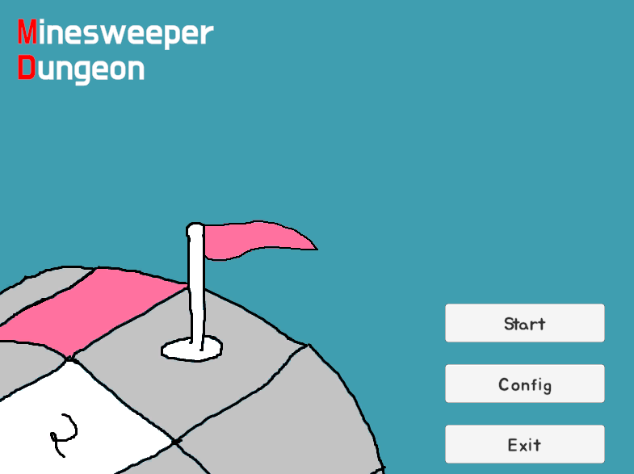
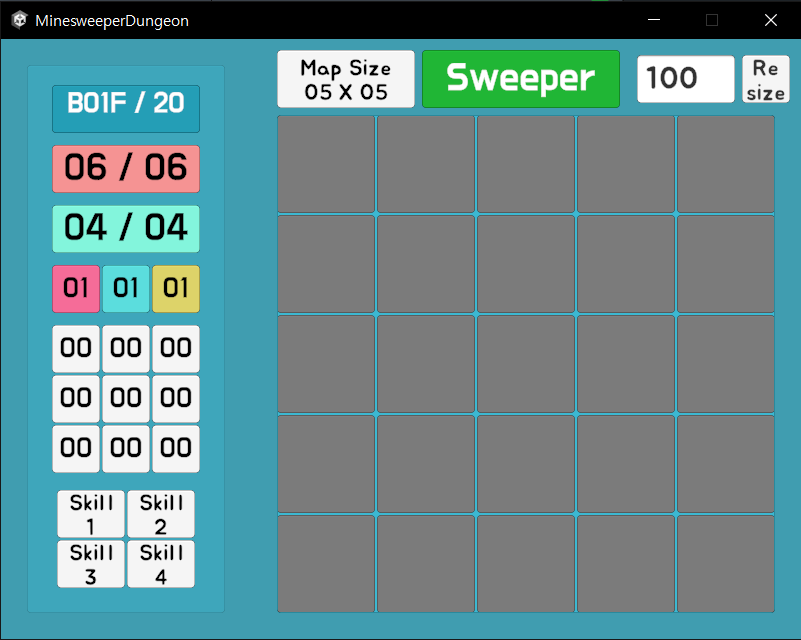

<b>1. 프로젝트 소개</b>

  
이 프로젝트는 전 세계적으로 유명한 게임인 <지뢰 찾기>를 유니티로 구현한다.  
<지뢰 찾기(Minesweeper)>는 바둑판식으로 배열된 타일 안에서 지뢰(mine)로 설정된 타일을 건드리지 않으면서, 그 개수를 알려 주는 주변 타일의 숫자를 통해 지뢰의 위치를 추리하는 게임이다.  
Microsoft Windows Home 및 Professional 번들 패키지에 포함된 기본 게임으로, Windows 3.1부터 Windows 7까지 탑재되었다.  
 

이번 프로젝트는 <지뢰 찾기>에 개인의 특색을 더하여 유니티로 구현해보고자 진행하였다. 

<b>2. 사용한 프로그램</b>

Unity 2022.3.62f2  
IDE : Visual Studio 2022  

<b>3. 세부 규칙</b>

  
플레이어는 지뢰찾기를 진행하되, 다양한 난이도를 즐길 수 있다. (쉬움, 보통, 어려움, 도전)  
난이도에 따라 맵의 크기, 크기 증가 속도, 지뢰/아이템의 비율, 도달 가능 층 등이 다르다.  
 

플레이어는 마우스를 통해 모든 조작이 가능하다.  
* 좌클릭 : 개방  
* 우클릭 : 깃발 설치/제거  
* 좌클릭 두번 : 주변 칸 모두 밝히기 (가능한 경우)  
 

지뢰는 3 가지로, 한 번 작동할 때마다 같은 종류의 지뢰에 받는 데미지가 증가한다  
아이템은 9 가지로, 지뢰의 데미지 감소, 체력 회복, 마력 회복의 3 종류가 3 가지씩 있다.  
스킬은 4 가지로, 특수한 능력을 보여준다.  
플레이어는 지뢰를 피하며 최대한 깊은 층에 도달하는 것이 목표다. 
 

  
게임 결과에 따른 점수와 등급을 확인 가능하다.  
 

<b>4. 프로그램의 장점</b>

<ul>
	<li>다양한 해상도 지원</li>
	최대한 다양한 해상도에서 즐길 수 있도록 여러 해상도를 지원한다.  
  다만, 제작자는 800 x 600의 기본 해상도로 즐기길 권장한다.  

  <li>더 재미있는 지뢰찾기</li>
  일반적인 지뢰찾기에 비해 다양한 요소가 추가되어 더욱 재미있게 즐길 수 있다  
</ul>

<b>5. 구현할 때 특히 공들인 점</b>

<ul>
	<li>편의성 고려</li>
	게임의 개인 설정이 가능하도록 음량 조절, 해상도 조절 등의 기능을 추가했다.  

  <li>UI 직관성</li>
	게임에 필요한 모든 정보를 한 눈에 확인할 수 있도록 하였다.  
  그런데 이게 보기 좋은 진 잘 모르겠다.  
</ul>

<b>6. 프로그램에 개선이 필요한 점</b>

<ul>
	<li>객체지향성 부족</li>
  개발 과정에서 객체지향을 전혀 고려하지 않고, 즉석에서 바로 생각나는 대로 기우는 방식으로 개발했다.  
  덕분에 현재 코드는 매우 난잡하고, 차후 수정과 추가가 힘든 형태이다.  
  객체지향 언어와 설계를 사용하는 이유에 대해 배울 수 있었다.  
  
  <li>효과음 부재</li>
  플레이어의 행동에 따른 효과음이 없는 상태이다.  
  따라서, 플레이어는 모든 행동의 결과를 무조건 시각으로 확인해야 한다.  
  이는 플레이어의 시각적 피로도를 유발하고, 장기적 플레이에 악영향을 끼칠 수 있다.  
  
  <li>보상 부재</li>
  시중의 다른 지뢰찾기 게임을 두고 이 게임을 즐길 유인 요소가 부족하다.  
</ul>

<b>7. 기타</b>

음원은 chocis 사이트에서, 특히 Sakura Girl의 노래를 많이 사용했습니다.  
https://www.chosic.com/free-music/all/?keyword=Sakura+Girl&artist  
